<!-- Header with animated typing effect -->
<div align="center">
  
</div>

<!-- Professional Banner -->
<div align="center">
  
</div>

<!-- About Section with Icons -->
<div align="center">
  <h2>🚀 About Me</h2>
  <p>
    
    
    
  </p>
</div>

<!-- Quote Section -->
<div align="center">
  
</div>

---

## 💫 What Drives Me

```python
class ShishirSrivastav:
    def __init__(self):
        self.role = "Senior Python Developer"
        self.experience = "4+ years"
        self.philosophy = "If it's structured, it can be automated"
        self.passion = ["Generative AI", "Clean Code", "Problem Solving"]
        self.current_focus = "Building AI-powered solutions"
    
    def daily_routine(self):
        return [
            "☕ Coffee + Code",
            "🧠 Learn something new",
            "🔧 Build & Automate",
            "📚 Share knowledge",
            "🎯 Solve complex problems"
        ]
    
    def fun_fact(self):
        return "Only my code has logic, not my conversations 😄"
```

---

## 🎯 What I Do

<div align="center">
  <table>
    <tr>
      <td align="center" width="33%">
        
        <h3>🔧 Development</h3>
        <p>Building robust Python applications with clean, maintainable code following agile methodologies</p>
      </td>
      <td align="center" width="33%">
        
        <h3>🤖 AI Innovation</h3>
        <p>Exploring Generative AI capabilities and building intelligent solutions that make a difference</p>
      </td>
      <td align="center" width="33%">
        
        <h3>📚 Knowledge Sharing</h3>
        <p>Creating educational content on YouTube and Instagram to help others learn AI with Python</p>
      </td>
    </tr>
  </table>
</div>

---

## 🛠️ Tech Arsenal

<div align="center">

### 💻 Languages & Frameworks


### 🗄️ Databases & Storage


### ☁️ Cloud & DevOps


### 🔧 Tools & Technologies


</div>

---

## 📊 GitHub Analytics

<div align="center">
  
  
</div>

<div align="center">
  
</div>

<div align="center">
  
</div>

---

## 🏆 Achievements & Recognition

<div align="center">
  
</div>

---

## 🌐 Connect & Follow My Journey

<div align="center">
  
### 📱 Social Media
[](https://www.linkedin.com/in/shishir-srivastav/)
[](https://www.instagram.com/programmatic.ly)
[](https://www.youtube.com/channel/UCCZiCzPtg9pmDwChJ4ROIpA)
[](https://shishirslearningjourney.hashnode.dev/)

### 📧 Let's Collaborate
[](mailto:shishir.workemail@gmail.com)

</div>

---

## 📚 Content & Learning

<div align="center">
  <table>
    <tr>
      <td align="center">
        
        <br><strong>YouTube Channel</strong>
        <br>Learn AI with Python through hands-on tutorials
        <br><a href="https://www.youtube.com/channel/UCCZiCzPtg9pmDwChJ4ROIpA">Watch & Learn</a>
      </td>
      <td align="center">
        
        <br><strong>Instagram</strong>
        <br>Quick bytes of programming knowledge
        <br><a href="https://www.instagram.com/programmatic.ly">@programmatic.ly</a>
      </td>
      <td align="center">
        
        <br><strong>Technical Blog</strong>
        <br>In-depth articles on development & AI
        <br><a href="https://shishirslearningjourney.hashnode.dev/">Read Articles</a>
      </td>
    </tr>
  </table>
</div>

---

## 🎯 Current Focus

```mermaid
graph LR
    A[🤖 Generative AI] --> B[🐍 Python Development]
    B --> C[☁️ Cloud Solutions]
    C --> D[📚 Knowledge Sharing]
    D --> A
    
    style A fill:#ff6b6b
    style B fill:#4ecdc4
    style C fill:#45b7d1
    style D fill:#96ceb4
```



---

## 💡 Philosophy

<div align="center">
  
</div>

> **"If it's structured, it can be automated"** - This drives my approach to solving complex problems through elegant, scalable solutions.

---

## 📈 Weekly Development Breakdown

<!--START_SECTION:waka-->
```text
Python       12 hrs 30 mins  ████████████░░░░░░░░░░░░░   48.2%
JavaScript   6 hrs 15 mins   ██████░░░░░░░░░░░░░░░░░░░   24.1%
SQL          3 hrs 45 mins   ███░░░░░░░░░░░░░░░░░░░░░░   14.5%
Docker       2 hrs 10 mins   ██░░░░░░░░░░░░░░░░░░░░░░░    8.4%
YAML         1 hr 15 mins    █░░░░░░░░░░░░░░░░░░░░░░░░    4.8%
```
<!--END_SECTION:waka-->

---

<div align="center">
  
  
  ### 🚀 Ready to build something amazing together?
  
  
  
  **⭐ Star my repositories if you find them helpful!**
  
</div>